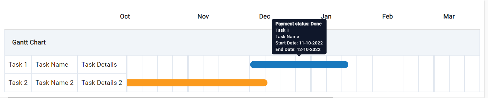

# custom-calendar-gantt
**Maintained by Srinith Reddy Gujula, Github handle: srinithreddyg**

Simple gantt chart package with customizable fields and tooltip.

**How to use:/n**
create an array of tasks which contain data in the following format, one can also pass a react fragment as tooltip.

```
const tasks: Task[] = [
      {
        startDate: '2022-11-10',
        endDate: '2022-12-10',
        color: '#1878BD',
        tableColumns: [ "Task 1", "Task Name", "Task Details"],
        tooltip: 
          <React.Fragment>
            <b>{'Payment status: Done'}</b>
            <div>{'Task 1'}</div>
            <div>{'Task Name'}</div>
            <div>{`Start Date: ${dayjs('2022-11-10').format('MM-DD-YYYY')}`}</div>
            <div>{`End Date: ${dayjs('2022-12-10').format('MM-DD-YYYY')}`}</div>
          </React.Fragment>
        
      },
      {
        startDate: '2022-09-01',
        endDate: '2022-11-15',
        color: '#FB9A1D',
        tableColumns: [ "Task 2", "Task Name 2", "Task Details 2"],
        tooltip: 
          <>
            <b>{'Payment status: Pending'}</b>
            <div>{'Task 2'}</div>
            <div>{'Task Name 2'}</div>
            <div>{`Start Date: ${dayjs('2022-09-01').format('MM-DD-YYYY')}`}</div>
            <div>{`End Date: ${dayjs('2022-11-15').format('MM-DD-YYYY')}`}</div>
          </>
      }
    ]
```

**Component takes following fields as props:**
- **tasks: Tasks[]** // *table columns contains the columns that one wants to display to the left of calendar view* 
- **cellsPerMonth: number** // *number of cells per month*
- **numOfMonthsDisplayed: number** //*number of months displayed*

```
<GanttChart tasks={tasks} cellsPerMonth={4} numOfMonthsDisplayed={6} tableHeader={'Gantt Chart'}/>
```


